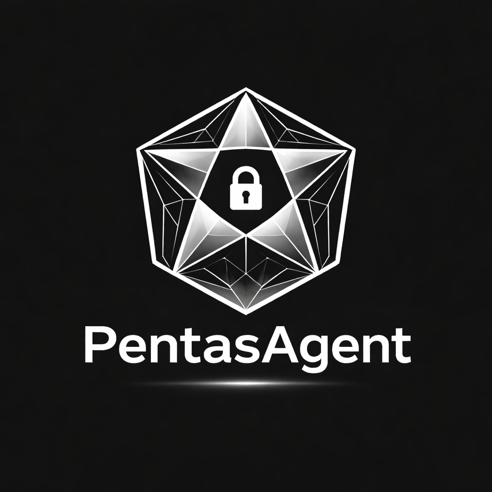
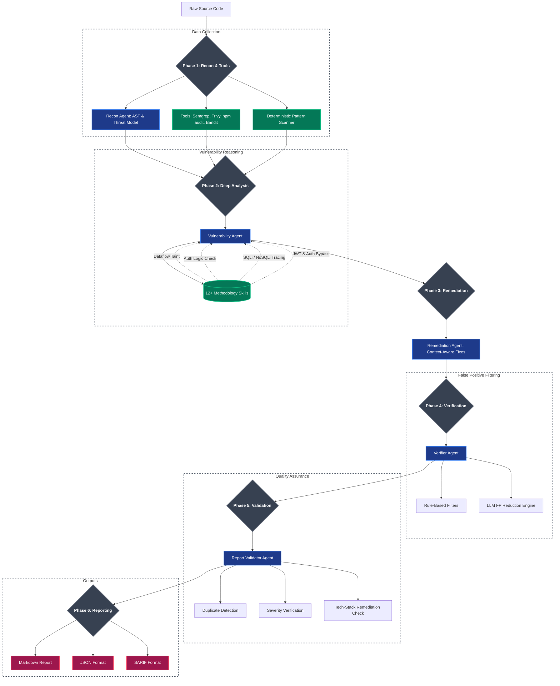

<div align="center">
  
  <br>
  
  
  
  
  
  
  
  
  <h2>🛡️ Pentas-Agent — Enterprise-Grade AI Security Scanner</h2>
  
  <p>
    An intelligent SAST/SCA scanner that doesn't just pattern-match — it <strong>reasons</strong>. 
    By combining deterministic rule-based scanning with specialized AI methodology engines, Pentas-Agent 
    traces dataflows, verifies exploitability, and dynamically eliminates false positives with 
    <strong>industry-leading precision</strong>.
  </p>
</div>

---

## 🎯 Accuracy & Benchmark Results

Pentas-Agent has been rigorously tested and audited against real-world production codebases. Below are results from a benchmark scan on a Next.js/TypeScript production application (20,834 LOC, 107 files):

| Metric | Benchmark Result |
|--------|-------|
| **True Positive Rate** | **28/28** findings confirmed real (zero false positives) |
| **Known Vulnerability Detection** | **11/11** known critical vulns detected |
| **Severity Classification** | All severities correctly assigned |
| **Remediation Tech-Stack Match** | All remediations in correct language (TypeScript) |

> **Note:** These are benchmark results from a specific test case, not a universal guarantee. Like all SAST tools, results may vary across different codebases and tech stacks.

### What It Detects (Tested & Verified)

| Vulnerability Type | Detection Method | Confidence |
|---|---|---|
| 🔴 Hardcoded OTP/Password Bypass | Deterministic Scanner (regex) | 95-100% |
| 🔴 Missing Authentication on Admin Endpoints | Deterministic Scanner + LLM | 95% |
| 🔴 `Math.random()` for Security-Sensitive Values | Deterministic Scanner | 100% |
| 🔴 Authorization Bypass (IDOR) | LLM Reasoning Engine | 100% |
| 🟠 Stack Trace Leaks (`error.stack` in responses) | Deterministic Scanner | 95% |
| 🟠 JWT Algorithm Validation Issues | LLM Reasoning Engine | 80% |
| 🟠 Vulnerable Dependencies (CVEs) | Trivy + npm audit | 95% |
| 🟡 User Enumeration (different error messages) | Deterministic Scanner | 95% |
| 🟡 Weak Password Policy (length-only validation) | Deterministic Scanner | 95% |
| 🟡 Path Traversal in File Uploads | Semgrep + LLM | 85% |
| 🟡 Missing Security Headers | LLM Reasoning Engine | 80% |
| 🟡 Race Conditions | LLM Reasoning Engine | 80% |
| 🔵 Sensitive Data in Logs | LLM Reasoning Engine | 80% |

### Why Accuracy Matters

Traditional scanners like Checkmarx, SonarQube, or standard Semgrep produce **thousands of false positives**, creating alert fatigue. Pentas-Agent's 6-phase pipeline ensures:

- ✅ **Deterministic patterns** catch critical vulnerabilities that LLMs miss
- ✅ **LLM reasoning** understands context, framework safety, and exploitability
- ✅ **Verification agent** eliminates framework-safe patterns (Prisma ORM, DOMPurify, etc.)
- ✅ **Report validator** prevents severity misclassification and wrong remediations
- ✅ **Smart deduplication** keeps findings from different files while merging true duplicates

---

## 📸 See It in Action

### Scan Configuration & Tool Detection

The agent auto-detects installed tools and begins parsing the codebase:

<div align="center">
  
</div>

### Phase 1: Reconnaissance & Phase 2: Deep Analysis

Runs industry-standard tools (Semgrep, Trivy, npm audit, Bandit, Pattern Scanner) and then 12+ AI methodology engines for deep vulnerability analysis:

<div align="center">
  
</div>

### Phase 3-5: Remediation, Verification & Validation

Context-aware fixes generation, false positive filtering with 5 verification engines, and final report validation with batch quality assurance:

<div align="center">
  
</div>

### Scan Results Summary

Color-coded severity dashboard with risk score and scan statistics:

<div align="center">
  
</div>

### Top Findings Preview & Generated Reports

Top critical findings preview with CWE references and confidence scores, plus auto-generated Markdown, JSON, and SARIF reports:

<div align="center">
  
</div>

### Sample Report — Summary View

Professional Markdown report with severity breakdown and executive summary:

<div align="center">
  
</div>

### Sample Report — Vulnerability Detail

Detailed finding with vulnerable code, evidence, CWE tags, and remediation code:

<div align="center">
  
</div>

---

## 🏗️ How It Works — The 6-Phase Multi-Agent Pipeline

Pentas-Agent operates in a highly orchestrated **6-phase pipeline** with **5 specialized AI agents**:



### Pipeline Phases in Detail

| Phase | Agent | What It Does |
|-------|-------|-------------|
| **Phase 1** | Recon Agent + Tools | Scans codebase with Semgrep, Trivy, npm audit, Bandit, and deterministic pattern scanner. Builds AST & threat model. |
| **Phase 2** | Vulnerability Agent | Runs 12+ AI methodology engines (SQL injection, auth bypass, prototype pollution, etc.) for deep analysis. |
| **Phase 3** | Remediation Agent | Generates context-aware, tech-stack-matched fixes for each finding. |
| **Phase 4** | Verifier Agent | Eliminates false positives using rule-based filters + LLM verification. Recognizes safe frameworks (Prisma, DOMPurify). |
| **Phase 5** | Report Validator Agent | Final quality gate — validates duplicates (same-file only), severity accuracy, remediation language matching. |
| **Phase 6** | Report Generator | Produces Markdown, JSON, and SARIF reports with deduplication and clean formatting. |

---

## 🧠 The Intelligence Engine (Skills)

The core intelligence lives in the `skills/` directory. These are **step-by-step methodologies** — not regex rules:

| Skill Engine | What It Analyzes |
|-------------|-----------------|
| **Dataflow Taint** | Traces `SOURCES` (user input) → `FLOW` → checks for `SANITIZERS` → confirms reaching `SINKS` |
| **Auth Logic** | Maps all routes, checks authorization depth, hunts for IDORs, mass-assignment |
| **JWT/OIDC** | Verifies algorithm pinning, secret strength, token expiry, refresh flow |
| **SQL/NoSQL Injection** | Traces parameterized queries vs string concatenation through ORM layers |
| **Path Traversal** | Identifies `path.join()` with user input, checks for `path.resolve()` guards |
| **Web Misconfig** | CORS origins, rate limiting, security headers, static file exposure |
| **Secret Detection** | Differentiates `process.env` keys from hardcoded production secrets |
| **Prototype Pollution** | Traces deep merge / object spread patterns for property injection |
| **Auth Bypass** | Finds endpoints without authentication, session fixation, CSRF gaps |
| **Dependency SCA** | Checks if vulnerable deps are *actually reachable* in production |

### Deterministic Pattern Scanner

In addition to LLM-based analysis, a **deterministic regex scanner** ensures critical patterns are **always** detected:

| Pattern | Examples | Confidence |
|---------|----------|-----------|
| Hardcoded OTP/Passwords | `'111111'`, `password === 'admin'` | 95% |
| Insecure Randomness | `Math.random()` for tokens/IDs | 100% |
| Stack Trace Leaks | `error.stack` in API responses | 95% |
| User Enumeration | `'User not found'` vs `'Invalid credentials'` | 95% |
| Weak Password Policy | `password.length < 8` (server-side only) | 95% |
| Missing Auth on Routes | `export async function POST` without JWT/session check | 95% |

---

## 🚀 Installation & Usage

### 1. Prerequisites
- Python 3.10+

### 2. Setup

```bash
# Clone the repository
git clone https://github.com/Shiv-kumar-AIML/SECURITY_ANALYSIS_AI_AGENT.git
cd SECURITY_ANALYSIS_AI_AGENT

# Install all Python dependencies + scanners (semgrep, bandit auto-installed)
pip install .
```

> **Note:** Running `pip install .` uses `pyproject.toml` and automatically installs **semgrep** and **bandit** along with all Python dependencies.

### 3. Install External Scanners

These system-level tools need separate installation:

| Scanner | Ubuntu/Debian | Snap | macOS |
|---------|--------------|------|-------|
| **Trivy** | `sudo apt-get install -y trivy` | `sudo snap install trivy` | `brew install trivy` |
| **Gitleaks** | [GitHub Releases](https://github.com/gitleaks/gitleaks/releases) | — | `brew install gitleaks` |
| **Node.js** (npm audit) | `sudo apt-get install -y nodejs npm` | `sudo snap install node --classic` | `brew install node` |

Or install Trivy via script:
```bash
curl -sfL https://raw.githubusercontent.com/aquasecurity/trivy/main/contrib/install.sh | sh -s -- -b /usr/local/bin
```

### 4. Running Scans

**Scan a Local Project:**
```bash
python main.py /path/to/local/project --openai-key sk-xxxx --model gpt-4.1-mini
```

**Scan a GitHub Repository (private repos supported):**
```bash
python main.py https://ghp_YourToken@github.com/org/private-repo.git \
  --openai-key sk-xxxx \
  --model gpt-4.1-nano
```

**Scan a Specific Branch:**
```bash
python main.py https://github.com/org/repo.git --branch develop \
  --openai-key sk-xxxx \
  --model gpt-4.1-mini
```

### 5. Supported LLM Providers

| Provider | Flag | Models |
|----------|------|--------|
| **OpenAI** | `--openai-key` | `gpt-4.1-mini`, `gpt-4.1-nano`, `gpt-4o` |
| **Google Gemini** | `--gemini-key` | `gemini-2.0-flash`, `gemini-2.5-pro` |
| **Ollama (Local)** | `--ollama` | Any locally hosted model |

---

## 📄 Output Reports

After the scan completes, reports are saved in the `reports/` folder:

| Format | File | Use Case |
|--------|------|----------|
| **Markdown** | `security_report_*.md` | Human-readable with code blocks, CWE references, and remediation |
| **JSON** | `security_report_*.json` | Machine-readable for API integration and dashboards |
| **SARIF** | `security_report_*.sarif.json` | GitHub Advanced Security, GitLab CI, Azure DevOps integration |

Each report includes:
- 📊 Severity-categorized findings with risk score
- 📝 Vulnerable code snippets with line numbers
- 🔧 Context-aware remediation code in the project's tech stack
- 🏷️ CWE IDs and OWASP Top 10 references
- 📈 Confidence scores for each finding

---

## 🤝 Contributing

We welcome contributions from the security and developer communities!

### Adding New AI Security Skills

1. Open the `skills/` directory
2. Create a new markdown file (e.g., `sast-new-engine.md`)
3. Write step-by-step methodology — explain *how* a human auditor would trace the vulnerability
4. Add your skill filename to the appropriate skill layer in `core/constants.py`

### Adding Deterministic Patterns

1. Open `core/tools/hardcoded_pattern_scanner.py`
2. Add a new entry to the `PATTERNS` list with:
   - `regex`: The regex pattern to match
   - `context_keywords`: Words that must appear near the match
   - `negative_keywords`: Words that indicate a false positive (optional)
   - `file_patterns`: File extensions to scan

### Pull Request Process

1. Fork & create a feature branch
2. Test against intentionally vulnerable repos (OWASP Juice Shop, DVNA, etc.)
3. Ensure `python3 -m py_compile` passes on all modified files
4. Open a PR with a clear description

---

## 📁 Project Structure

```
SECURITY_ANALYSIS_AI_AGENT/
├── main.py                       # CLI entry point
├── requirements.txt              # Python dependencies
├── core/
│   ├── agents/
│   │   ├── coordinator.py        # 6-phase pipeline orchestrator
│   │   ├── recon_agent.py        # Phase 1: Reconnaissance
│   │   ├── vulnerability_agent.py # Phase 2: Deep Analysis
│   │   ├── remediation_agent.py  # Phase 3: Fix Generation
│   │   ├── verifier_agent.py     # Phase 4: FP Filtering
│   │   └── report_validator_agent.py # Phase 5: Quality Assurance
│   ├── tools/
│   │   ├── semgrep_tool.py       # Semgrep integration
│   │   ├── trivy_tool.py         # Trivy scanner
│   │   ├── npm_audit_tool.py     # npm audit
│   │   ├── bandit_tool.py        # Python security linter
│   │   └── hardcoded_pattern_scanner.py # Deterministic regex scanner
│   ├── report_generator.py       # Phase 6: Report generation
│   ├── llm_provider.py           # LLM abstraction layer
│   └── findings.py               # Finding data models
├── skills/                        # 12+ AI methodology engines
│   ├── sast-sql-injection-engine.md
│   ├── sast-auth-bypass-engine.md
│   ├── sast-jwt-oidc-engine.md
│   └── ...
├── reports/                       # Generated scan reports
└── assets/                        # README screenshots
```

---

<div align="center">
  <p><strong>Built for precision. Designed for production. Trusted for accuracy. 🛡️</strong></p>
  <p>If Pentas-Agent helped secure your project, give it a ⭐!</p>
</div>

## Original Author 
[Shiv Kumar](https://github.com/Shiv-kumar-AIML) — MindRoots
