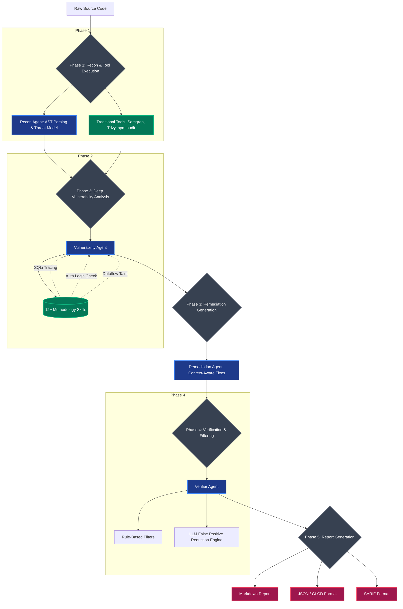

<div align="center">
  
  
  
  
  <h1>🛡️ Pentas-Agent</h1>
  <p><strong>Enterprise-Grade, Multi-Agent AI Security Vulnerability Detection Engine</strong></p>
  
  <p>
    An intelligent SAST/SCA scanner that doesn't just pattern-match, it <strong>reasons</strong>. 
    By combining traditional security tools with specialized AI methodology engines, Pentas-Agent 
    traces dataflows, verifies exploitability, and dynamically eliminates false positives.
  </p>
</div>

---

## 📸 See it in Action

Here is what it looks like when Pentas-Agent runs a deep analysis on a codebase:

<div align="center">
  
</div>
<br>
<div align="center">
  
</div>
<br>
<div align="center">
  
</div>

> **Note to developer**: Please save your uploaded screenshots into an `assets/` folder in the root directory (e.g., `assets/scan_configuration.png`, `assets/detailed_scan.png`, `assets/final_report.png`) for them to display here.

---

## 🌟 Why Pentas-Agent?

Traditional scanners (like standard Semgrep or Checkmarx) produce thousands of false positives because they rely on static grep-like patterns. **Pentas-Agent is different.**

- 🧠 **Methodology-Based Skills**: Instead of looking for `eval(...)`, the agent traces the dataflow: *Did this input come from an HTTP request? Was it sanitized by Zod? Did it reach the eval sink?*
- � **Multi-Agent Architecture**: Dedicated AI agents for Reconnaissance, Deep Analysis, Verification (False Positive Reduction), and Remediation.
- 🛡️ **Framework-Aware**: Automatically recognizes safety mechanisms in Drizzle ORM, Django ORM, Express auto-escaping, Fastify schemas, etc.
- 🧹 **Aggressive False Positive Filtering**: Dramatically reduces alert fatigue by eliminating test files, trusted constants, and dead code endpoints.

---

## 🏗️ How It Works (The Multi-Agent Flow)

Pentas-Agent operates in a highly orchestrated 6-phase pipeline. Here is the exact graph flow of how a repository goes from raw code to a verified security report:



---

## 🧠 The "Brain" of the Agent (Methodology Engine)

The core intelligence lives in the `skills/` directory. These are not regex rules; they are **Step-by-Step Methodologies** taught to the LLM. 

| Skill Category | Description of Analysis |
|----------------|-------------------------|
| **Dataflow Taint** | Identifies `SOURCES` (user input) -> traces `FLOW` -> verifies absence of `SANITIZERS` -> confirms reaching dangerous `SINKS`. |
| **Auth Logic** | Maps all routes, checks authorization depth, hunts for IDORs, and finds mass-assignment paths. |
| **Web Misconfig** | Enforces checks on CORS origin handling, Rate Limiting presence, Security Headers, and Static File exposure. |
| **Secret Detection** | Differentiates between securely externalized `process.env` keys and dangerously hardcoded production secrets. |
| **Dependency SCA** | Analyzes whether a vulnerable dependency is *actually reachable* and loaded in production (vs. dev-only). |

---

## 🚀 Installation & Usage

### 1. Prerequisites
- Python 3.10+
- `semgrep`, `trivy`, and `npm` installed in your system PATH.

### 2. Setup
```bash
# Clone the repository
git clone https://github.com/Shiv-kumar-AIML/SECURITY_ANALYSIS_AI_AGENT.git
cd SECURITY_ANALYSIS_AI_AGENT

# Install Python dependencies
pip install -r requirements.txt
```

### 3. Running Scans

To start a full multi-agent scan, run the CLI. You can target local directories or remote Git repositories.

**Scan a Local Project:**
```bash
python main.py /path/to/local/project --openai-key sk-xxxx --model gpt-4.1-mini
```

**Scan a GitHub Repository:**
```bash
python main.py https://github.com/mindrootstech/inked-web.git \
  --openai-key sk-xxxx \
  --model gpt-4.1-nano
```

**Scan a Private Repository (using Personal Access Token):**
```bash
python main.py https://ghp_YourTokenHere@github.com/org/private-repo.git \
  --openai-key sk-xxxx \
  --model gpt-4.1-mini
```

---

## � Output Reports

After the scan sequence is complete, the results are stored in the `reports/` folder:

1. **`security_report_YYYYMMDD-HHMMSS.md`**: A beautifully formatted, human-readable markdown file with vulnerability details, snippets, and step-by-step remediation code.
2. **`security_report_YYYYMMDD-HHMMSS.json`**: A structured format ready to be ingested by custom dashboards or CI/CD pipelines.
3. **`security_report_YYYYMMDD-HHMMSS.sarif.json`**: The industry standard format for integrating directly into GitHub Advanced Security (GHAS) or GitLab CI.

---

<div align="center">
  <p>Built for precision, designed for production. 🛡️</p>
</div>
